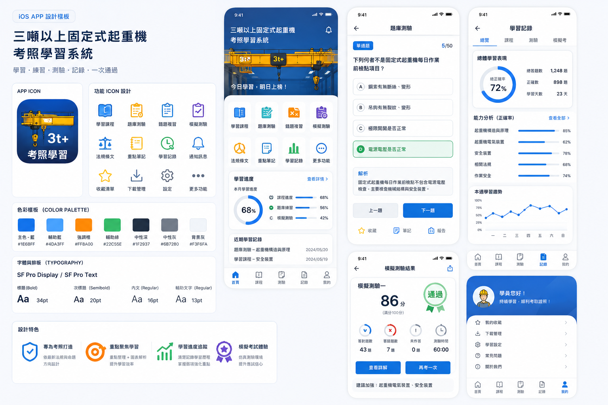

# 設計系統

## 參考設計板

此圖是 1536×1024 的視覺驗收基線，不作為直接裁切來源。正式 App 以 SwiftUI、Asset Catalog 與可縮放圖形重建，但首頁層級、品牌藍色 hero、功能入口、卡片密度、題目選項狀態、進度摘要及底部五分頁應與設計板保持一致；若因 iPad、Dynamic Type 或系統導覽元件調整，必須記錄差異理由。

## 色彩 token

| Token | HEX | 用途 |
| --- | --- | --- |
| `brandPrimary` | `#1E6BFF` | 主按鈕、選取狀態、進度主色 |
| `brandSupport` | `#4DA3FF` | 輔助資訊、淺層級 |
| `accentOrange` | `#FF8A00` | 重點、待複習、提醒；不可只靠顏色傳意 |
| `success` | `#22C55E` | 答對、通過、完成 |
| `textPrimary` | `#1F2937` | 主要文字 |
| `textSecondary` | `#6B7280` | 次要文字 |
| `surfaceBackground` | `#F3F6FA` | Light mode 背景 |
| `error` | 系統 red | 答錯／錯誤；搭配圖示與文字 |

色票在 Asset Catalog 以 Any／Dark／High Contrast 變體實作，不在 View 直接寫 hex。

## 字體

- 使用 Apple system font，不內嵌第三方字型。
- Title 34 bold、Section 20 semibold、Body 17 regular、Caption 13 regular 僅是起點；實作必須使用 Dynamic Type semantic styles。
- 題幹、選項、解析可放大至 Accessibility XXXL，不截字、不強制固定高度。

## 圖示策略

已匯入的 `Assets/UIUX/Production/CraneLearningAssets.xcassets` 提供 App Icon、色票與 12 組 raster 功能圖示。首頁功能入口優先使用這套已核准素材；系統導覽、狀態及無對應品牌圖示的動作才使用 SF Symbols。設計板 12 組功能對應：

| 功能 | 建議 SF Symbol |
| --- | --- |
| 學習課程 | `book.closed` |
| 題庫測驗 | `checklist` |
| 錯題複習 | `xmark.square` |
| 模擬測驗 | `timer` |
| 法規條文 | `scalemass` |
| 重點筆記 | `note.text` |
| 學習紀錄 | `chart.bar` |
| 本機提醒 | `bell` |
| 收藏 | `star` |
| 版本與內容 | `shippingbox` |
| 設定 | `gearshape` |
| 更多 | `ellipsis.circle` |

## 共用元件

- `ProgressRing`：整體正確率／完成度，有文字百分比。
- `LearningShortcutCard`：圖示、標題、狀態與可點擊區域至少 44×44 pt。
- `QuestionOptionRow`：未選／選取／正確／錯誤四狀態，同時用 icon、label 與顏色。
- `AnswerExplanationCard`：依序顯示答案、解析、另外解答、公開來源；空欄位不產生空區塊。
- `StatCard`：作答、正確、學習天數等數值，VoiceOver 合併為一個可理解句子。

## iPhone／iPad 行為

- iPhone 使用 5-tab；題目流程 push 到 feature navigation stack，但切 tab 必須能離開活動頁。
- iPad sidebar 永遠可切換主功能；detail 不可因繼續學習而鎖在內層 stack。側欄寬度採 240～280 pt、理想值 260 pt，橫向使用 balanced 常駐分割，直向維持系統可收合／覆疊行為。
- iPad sidebar 與首頁使用 inline navigation title，避免 768×1024 直向及 1024×768 橫向畫面被重複的大標題占用；產品名稱仍保留在側欄導覽列，頁面識別則由 inline 標題與 hero 共同提供。
- 首頁卡片內容上限為 860 pt，hero 內文上限為 900 pt；較寬視窗只延伸背景，不把圖示、標題及進度列無限拉開。
- iPad 分割視窗寬度不足時自然收斂，不另建一套 UI。

## 課程、測驗與模考呈現規則

- 課程／複習題卡：題目後直接依序顯示「答案、解析、另外解答、來源」，底部只放上一題、收藏／記憶與下一題；上方提供題號、進度與選題／跳題。
- 題庫測驗題卡：作答前不顯示答案；選項必須有 A–D 標記，作答後以圖示、文字與顏色同時呈現使用者答案及正解，再顯示解析與來源。
- 模擬測驗題卡：交卷前不顯示正誤、答案或解析；結果頁才分段顯示成績、正確率及逐題檢討。
- 同一題可出現在三種流程，但 stable ID、答案、解析與來源相同；差異只在互動與紀錄語意。

## 正式素材 gate

高解析素材包已依公開／私有邊界完成分層。完整包與畫面 mockup 留在 `PrivateResources/UIUX-Inbox/`，可用 App Icon、色票與功能圖示位於 `Assets/UIUX/Production/`。目前色票尚缺 Dark／High Contrast 變體，需在 App 骨架建立後補齊並做真機／模擬器驗證；不得直接從參考板裁切低解析圖示。
